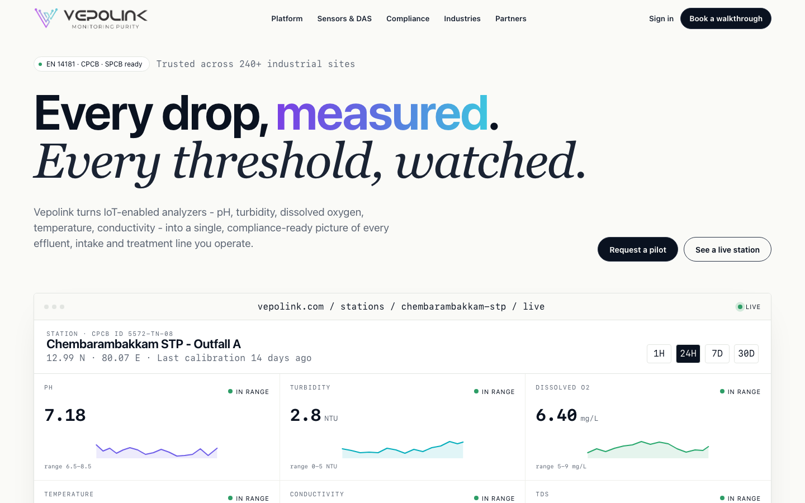

# Vepolink Website

Static, server-rendered HTML/CSS/JavaScript marketing website for `vepolink.com`.



## Technology

- Static server-rendered HTML in `index.html`
- CSS-only responsive layout and visual system in `assets/site.css`
- Small vanilla JavaScript enhancement layer in `assets/site.js`
- No build step required
- Can be hosted on any static hosting provider

## Features

- SEO-ready static content for important above-the-fold and section content
- Schema.org `Organization` and `WebSite` structured data
- Open Graph and Twitter card metadata
- `robots.txt` and `sitemap.xml`
- Responsive desktop and mobile layouts
- Lightweight dashboard visuals with client-side metric updates
- Content Security Policy and deployment headers in `_headers`
- Local assets for logos and favicon

## Run Locally

From the project folder:

```bash
cd /Users/anantmendiratta/Dev/Vepolink-website
python3 -m http.server 4173
```

Open:

```text
http://localhost:4173/
```

To stop the local server, press `Ctrl+C` in the terminal running the server.

## Alternative Preview

Because this is a static site, you can also open `index.html` directly in a browser:

```text
file:///Users/anantmendiratta/Dev/Vepolink-website/index.html
```

Using the local server is preferred because it behaves closer to production.

## Deploy Notes

Upload the project files as static assets. Make sure the deploy platform applies the headers in `_headers`, especially the Content Security Policy and `frame-ancestors` directive.
